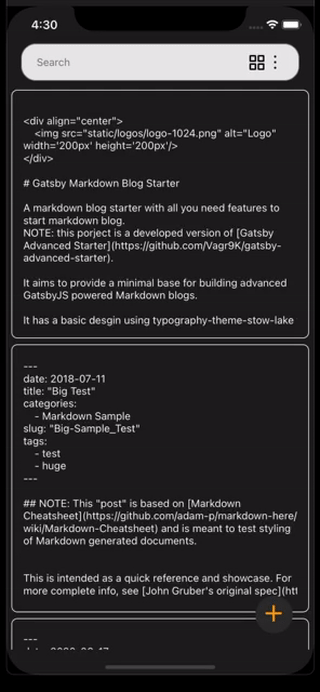
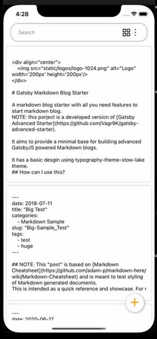

# GitKeep

My life is in markdown documents. I have all my notes from work, my to-do lists, my diary, project ideas, books read; they all sit in GitHub repos. To interact with them on my mobile, I built a mobile app to use GitHub’s API to update my markdown files on the go. This was built with React Native.

<p align="center">
        
        
        
</p>

### Flow for ```git clone``` and ```git push``` in the app

I use the endpoint below to pull down all the files from a repo:
https://docs.github.com/en/rest/reference/repos#get-repository-content

If file ends in .md, it's added to a list to download the content from, that content is then displayed on the cards.

To pull down the content of each file, I use the tree SHA value for the master branch, and pull the content like this:
```
    const shaUrl = 'https://api.github.com/repos/' + userName + '/' + repoName + '/git/blobs/';

    await Promise.all(files.map(f => fetch(proxyUrl + shaUrl + f.fileInfo.sha, { method: 'GET', headers: headers })))
        .then(result => Promise.all(result.map(res => res.json())))
        .then(res => {
            for (let i = 0; i < res.length; i++) {
                if (res[i].content === "") {
                    files[i].fileContent = "#Empty Note :("
                }
                else {
                    files[i].fileContent = Buffer.from(res[i].content, 'base64').toString('ascii') as string
                }
            }            
        })
        .catch(error => {
            throw(error);
        });
```

Once a file is modified, the file is updated using this endpoint:
https://docs.github.com/en/rest/reference/repos#create-or-update-file-contents

## iOS Deploy

Open up the ```.xcworkspace``` file in xCode.

Run ```pod install``` in the ios folder and then click the deploy button to your connection iPhone.

## To Deploy to Android Phone

expo build:android -t apk 
adb install filename.apk

## Next steps 

- [X] Clean up the authentication flow
- [X] Get the screens nicely passing props to eachother 
- [X] Start on the integration with GitHub
- [] Convert to this <https://www.npmjs.com/package/@octokit/core>
- [X] One tap on a note expands it out, hold on it to edit it 
- [] On a note there will be a three circle icon in the upper right, which will have delete, rename and move directory 
- [X] Pull up to refresh
- [] Some sort of alert that the app is refreshing when you edit a document (maybe an acitivity indicator then a tick once loaded)
- [] Get the new note screen working, with an option of what directory to put the new note in 
- [X] https://github.com/arnnis/react-native-fast-toast
- [] Set height of note to zero (or hide it), until webview is ready
- [X] Menu on a three ellepsis menu on the search bar (option to re-choose your repo)
- [] Last edited dates on notes
- [] Drag to delete notes? 

